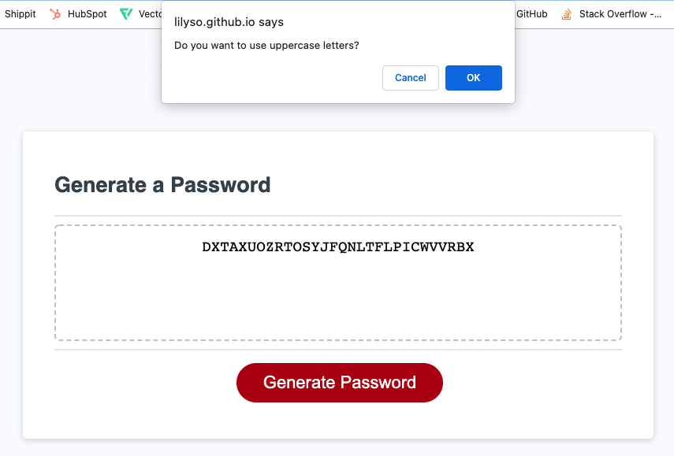
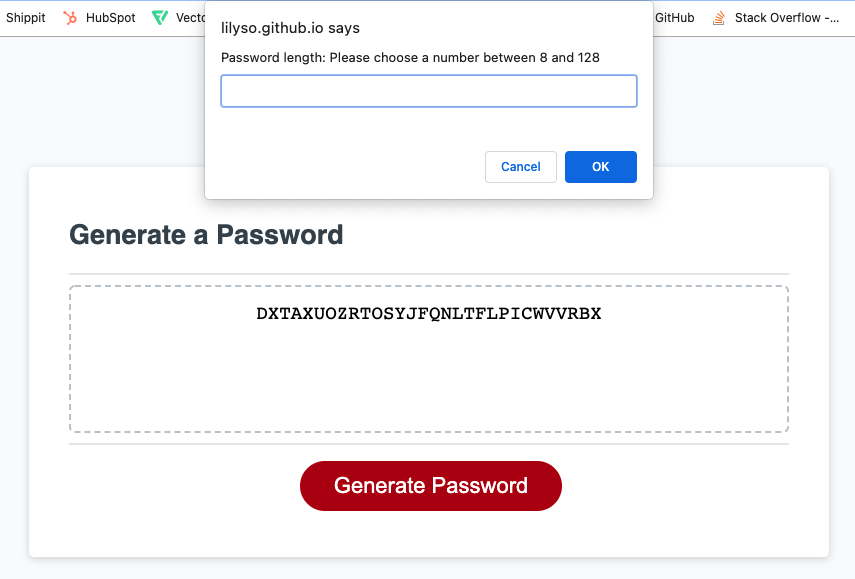
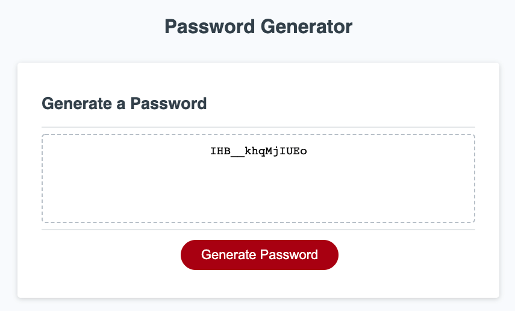

# Password Generator

> Basic password generator.
> Live demo [_here_](https://lilyso.github.io/password-generator/).

## Table of Contents

- [General Info](#general-information)
- [Technologies Used](#technologies-used)
- [Features](#features)
- [Screenshots](#screenshots)
- [Setup](#setup)
- [Project Status](#project-status)
- [Room for Improvement](#room-for-improvement)
- [Contact](#contact)

## General Information

Basic password generator that allows the user to create a password with randomised letters, numbers and special characters, from 8 to 128 characters in length.

## Technologies Used

- HTML5
- CSS3
- Javascript

## Features

- Ability to generate password with uppercase letters, lowercase letters, numbers and special characters.
- Password is randomly generated from user's selection.

## Screenshots

## Setup

Download from repository.

## Project Status

Project is: _in progress_.

## Room for Improvement

Room for improvement:

- A quicker way to select and copy the password for use.
- Styles could be improved. Currently very basic.

To do:

- Save to clipboard button.
- Tool tip to notify user that the password has been copied to their clipboard.
- Add styles.

## Contact

Created by [@lilyso](https://github.com/lilyso).
